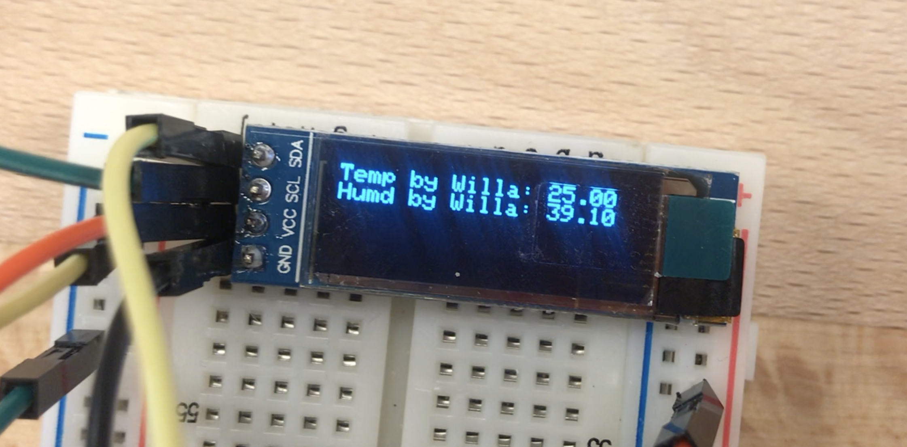

# __End to end, publish and subscribe__

## __Integrating Sensing, Publishing and Subscription__

This program allows users to subscribe to a topic on a server and retrieve information from said topic.

The data we are collecting is temperature and humidity from a DHT22 sensor published to a channel named _willa/Temp_

--you can customize the code to suit your needs--

## Output
Here is a picture of the data displayed on an OLED module:

